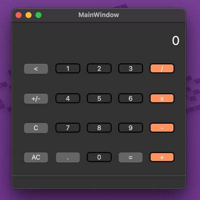

# About

A basic calculator in Qt (Pyside6) — In Progress



# Local Dev

Create a virtual environment and install requirements.

```shell
python3 -m venv venv
source venv/bin/activate
pip install -r requirements.txt
```

Launch the app.

```shell
pyside6-project run
```

# Edit GUI

```shell
pyside6-designer form.ui
```

Or this also works:

```shell
open ./venv/lib/python3.13/site-packages/PySide6/Designer.app form.ui
```

# Build Binary

```shell
pyside6-project deploy
```